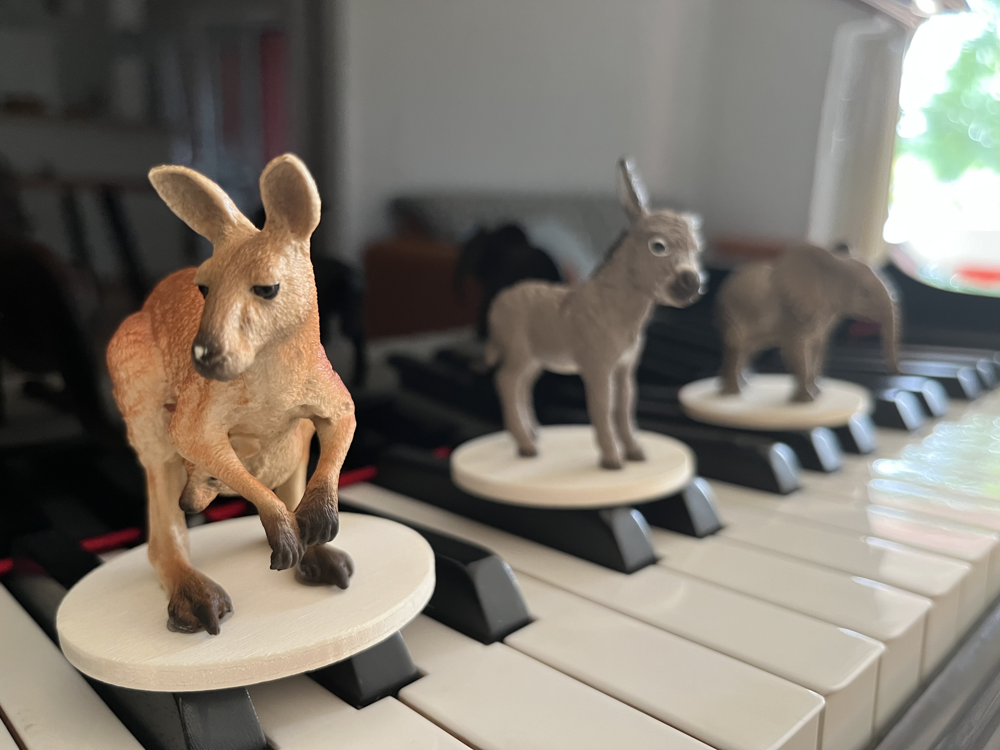

# Le carnaval des animaux

An audiophile music system for kids!

</img>

## Video

## Requirements

- **Spotify premium.**
- A Raspberry Pi and a piece of software implementing [Spotify Connect](https://support.spotify.com/us/article/spotify-connect/). I am using [Moode](https://moodeaudio.org) (an audiophile project) but there are other options like [Raspotify](https://github.com/dtcooper/raspotify).

## Implementation

- Attach an [NFC reader hat](https://www.waveshare.com/wiki/PN532_NFC_HAT) to the Raspberry Pi
- Build a set of figurines, each with an RFID tag
- Associate tracks (multiple tracks can be associated), or playlists, or albums to each figurine
- Run a process that plays the track (or one of the tracks) associated to the figurine 🐘🦘🐢 whenever it is placed over the reader (the track is played on the Spotify connect device specified in the configuration.)

The whole thing runs as a `systemd` process that constantly polls the NFC reader and streams the track if a valid, configured RFID is detected.

See additional details [here](./src/app/).
