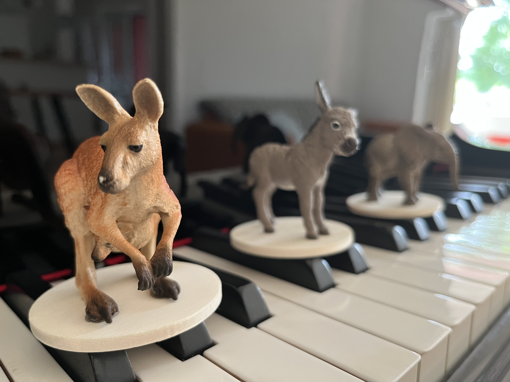
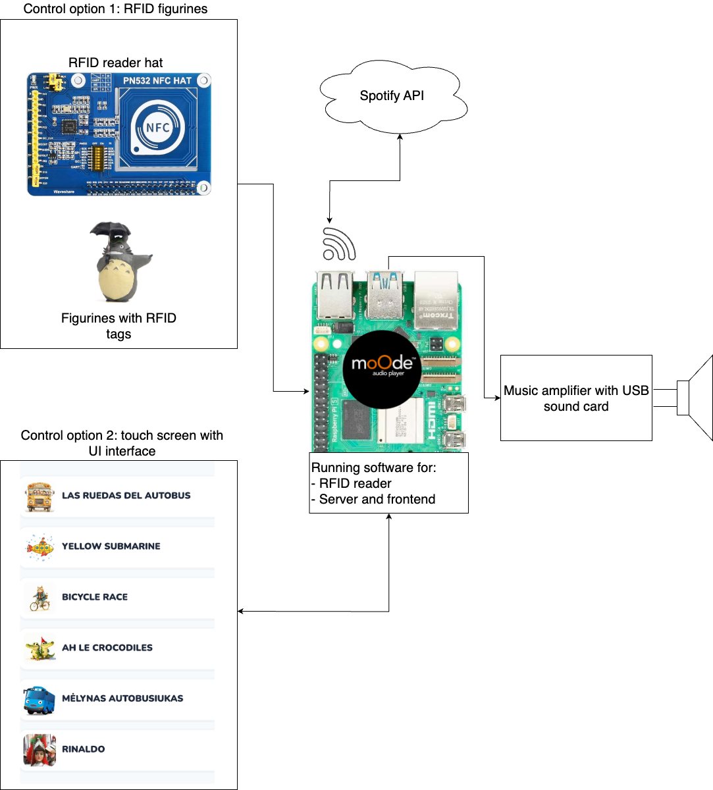

# Le carnaval des animaux

> A music control system designed for young children.

</img>

This project implements a system that enables young children to control the music they listen to. It is a control system for young music lovers.

## Video

## Requirements

- This project requires Spotify Premium, but with some effort, that part should be optional. You can modify the project to play music from a different source (e.g., your local files).
- If you use Spotify, you need a piece of software that implements [Spotify Connect](<(https://support.spotify.com/us/article/spotify-connect/)>). I recommend using [moOde](<(https://moodeaudio.org)>), an amazing audiophile project, but there are other options.
- You require a Raspberry Pi to run the software and play music.
- A mechanism to control which music to play (see below).

## Implementing a control

_Figure: a simplified block diagram of the system_

In general, the system consists of three parts: a music source (e.g., Spotify), a music player (e.g., a Raspberry Pi running moOde connected to an amplifier and speakers, or connected to a Bluetooth speaker), and a control mechanism that allows children to choose the music they want to play.

The figure below illustrates the specifics of the system that I implemented.

_Figure: my system with two optional control mechanisms._

Initially, I only implemented the RFID-based control, which can be used by very young children. Recently, I added a second control mechanism intended for older children who can read. Both mechanisms can be used independently or together.

## Description of the software

This project implements a collection of simple Python modules that run as a `systemd` service on a Raspberry Pi. I started with a Raspberry Pi 3 and I am now using a Raspberry Pi 5.

Tracks, albums, and playlists associated to each identifier are configured in a [JSON file](./conf.json). The script reads the user control and plays tracks via the Spotify Web API.

**Important note:** at least one of the control mechanisms must be enabled in the configuration file.

### Control mechanism 1: RFID figurines

- To enable this mechanism, set `general.use_rfid_control` to `true` in the [configuration file](./conf.json).
- Uses an [NFC reader hat](https://www.waveshare.com/wiki/PN532_NFC_HAT) attached to the Raspberry Pi.
- Uses a set of figurines, each with an RFID tag.
- Run a process that plays the associated track (or one of the associated tracks) whenever a figurine 🐘🦘🐢 is placed over the reader. The track is played on the Spotify connect device specified in [the configuration](./config/secrets-template.json).

### Control mechanism 2: touchscreen

- To enable this mechanism, set `general.use_touchscreen_control` to `true` in the [configuration file](./conf.json).
- This option requires a desktop environment and a touchscreen connected to the Raspberry Pi. I am using the [official Raspberry Pi 7" touchscreen](https://www.raspberrypi.com/products/touch-display-2/).
- An additional `systemd` service runs the web interface. I configured my desktop environment to open the web interface in full-screen mode automatically when the Raspberry Pi boots (see details below).

## Implementation details

See additional details [here](./src/app/).
